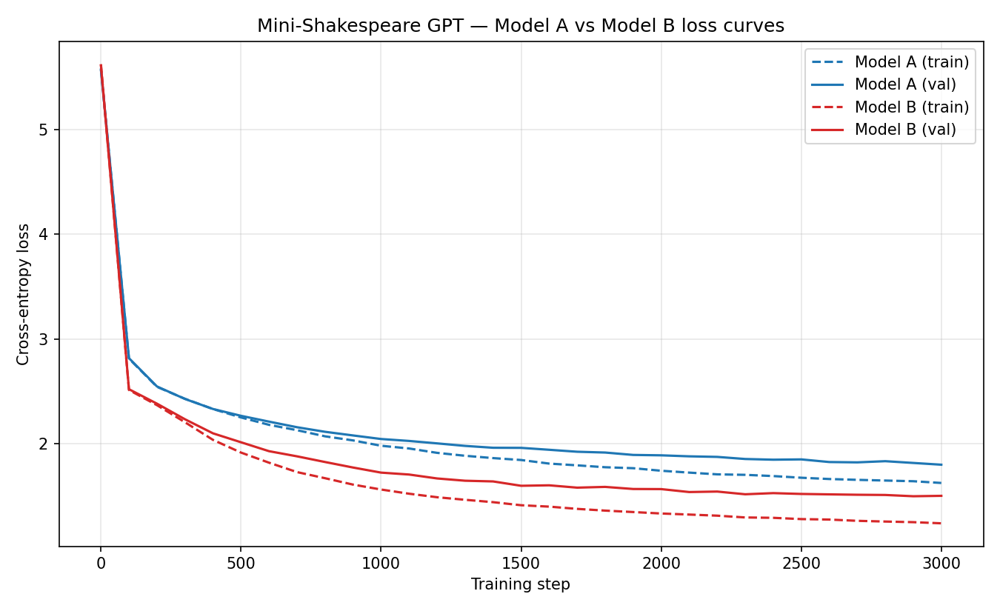

# Mini-Shakespeare LLM



A small GPT-style transformer built from scratch in PyTorch and trained on the
Tiny Shakespeare corpus, using a byte-level tokenizer (fixed vocabulary of 256).
Two configurations (Model A: baseline, Model B: scaled) are trained, evaluated
on held-out validation loss/perplexity, and benchmarked qualitatively against
Gemini Flash. Full writeup: [`report/report.md`](report/report.md)
([PDF](report/report.pdf)).

The repo is split into five parts:

- `diagram/` — the microGPT blueprint understanding notes and the annotated
  architecture diagram — see
  [`diagram/blueprint_notes.md`](diagram/blueprint_notes.md).
- `data/` — the data ingestion pipeline (byte tokenizer, load / split / batch).
- `my-transformer/` — the transformer model, a shape-verification script, and the
  training script for Model A / Model B.
- `evaluation/` — final validation loss/perplexity and generation benchmarking
  against Model A, Model B, and Gemini Flash.
- `report/` — the final report (Markdown + PDF).

## Structure

```
.
├── diagram/                          # Task 1: blueprint notes + annotated diagram
│   ├── blueprint_notes.md           # notes on how microGPT works + diagram-to-code mapping
│   ├── architecture_diagram.png     # hand-annotated microGPT architecture diagram
│   ├── architecture_diagram.svg     # editable vector source (Excalidraw export)
│   └── Step1_microGPT_Blueprint.docx # original source document
├── data/                            # data pipeline  (byte-level, vocab = 256)
│   ├── input.txt                    # Tiny Shakespeare corpus (~1.1 MB)
│   ├── tokenizer.py                 # UTF-8 byte tokenizer (encode / decode)
│   ├── data.py                      # load -> tokenize -> 90/10 split -> get_batch
│   ├── test_data.py                 # tests for the pipeline
│   └── example_for_training_team.py # minimal usage example
├── my-transformer/                  # the model + training
│   ├── model.py                     # GPTConfig + GPT architecture + generate()
│   ├── verify_shapes.py             # walks a real batch, asserts every tensor shape
│   ├── train.py                     # trains Model A / Model B, logs + plots loss curves
│   ├── checkpoints/                 # (generated) model_a.pt, model_b.pt
│   └── logs/                        # (generated) *_losses.csv, loss_curves.png
├── evaluation/                      # Task 5: metrics + generation benchmarking
│   ├── eval_metrics.py              # val loss + perplexity + hyperparameter log
│   ├── generate_comparisons.py      # 150-token completions, Model A + Model B
│   ├── gemini_template.md           # manual paste-in template for Gemini Flash
│   ├── comparison_table.py          # merges A / B / Gemini into one table
│   └── outputs/                     # (generated) metrics.json/csv, generations.json,
│                                     #             perplexity_comparison.png, comparison_table.md
├── report/
│   ├── report.md                    # final report (source)
│   └── report.pdf                   # final report (submission copy)
├── requirements.txt
└── README.md
```


## Setup

```bash
python -m venv .venv
source .venv/bin/activate          # Windows: .venv\Scripts\activate
pip install -r requirements.txt
```


## Run

Data pipeline tests:

```bash
cd data
python test_data.py
```

Model self-test and full tensor-shape verification:

```bash
cd my-transformer
python model.py           # quick forward + generate self-test
python verify_shapes.py   # full (B, T, C) shape trace + sanity checks
```


## Training Model A and Model B

`my-transformer/train.py` trains both experiment configurations and produces
the loss-comparison plot required for Part 4:


|                               | Model A (baseline) | Model B (scaled) |
| ----------------------------- | ------------------ | ---------------- |
| layers (`n_layer`)            | 2                  | 4                |
| heads (`n_head`)              | 4                  | 8                |
| embedding dim (`n_embd`)      | 128                | 256              |
| context length (`block_size`) | 64                 | 128              |
| parameters                    | ~437K              | ~3.25M           |


```bash
cd my-transformer
python train.py                    # trains Model A then Model B, 3000 steps each
python train.py --model a          # train only Model A
python train.py --model b          # train only Model B
python train.py --steps 3000       # override the step count (same count for A and B)
python train.py --device cuda       # force cpu / cuda / mps
```

This writes:

- `my-transformer/checkpoints/model_a.pt`, `model_b.pt` — trained weights + config
- `my-transformer/logs/model_a_losses.csv`, `model_b_losses.csv` — step, train_loss, val_loss
- `my-transformer/logs/loss_curves.png` — Model A vs Model B train/val loss curves

Part 5 (final validation loss, perplexity, and generation benchmarking) reads
these checkpoints and CSVs from the `evaluation/` folder.

## Running the evaluation

Requires the checkpoints from the training step above to already exist.
Run in this order from the `evaluation/` folder:

```bash
cd evaluation
python eval_metrics.py           # -> outputs/metrics.json, metrics.csv, perplexity_comparison.png
python generate_comparisons.py   # -> outputs/generations.json (4 prompts x 150 tokens x Model A/B)
```

Then, to add the Gemini Flash column: open `gemini_template.md`, paste each
prompt into the Gemini web UI / AI Studio (Gemini Flash, default settings),
and paste the completions back into the file. Then:

```bash
python comparison_table.py       # -> outputs/comparison_table.md
```

If `gemini_template.md` is still empty, `comparison_table.py` prints a
warning and marks the Gemini column `PENDING` rather than leaving it blank
or inventing a result.

### Results summary

Final validation loss / perplexity, computed as a deterministic full pass
over the entire held-out validation slice (see `evaluation/eval_metrics.py`;
regenerate this table from `evaluation/outputs/metrics.json` if models are
retrained):

|                              | Model A (baseline) | Model B (scaled) |
| ---------------------------- | ------------------- | ----------------- |
| layers / heads / embd / ctx  | 2 / 4 / 128 / 64     | 4 / 8 / 256 / 128  |
| parameters                   | 436,992              | 3,254,784          |
| final val loss (full pass)   | 1.7952                | 1.4983              |
| perplexity (full pass)       | 6.02                  | 4.47                |

Model B's larger depth/width/context consistently lowers both loss and
perplexity over Model A. Qualitative generation samples and the Gemini Flash
comparison live in `evaluation/outputs/generations.json` and
`evaluation/outputs/comparison_table.md`; full discussion in
[`report/report.md`](report/report.md) ([PDF](report/report.pdf)).

## Using the model

```python
from model import GPTConfig, GPTLanguageModel

cfg   = GPTConfig(vocab_size=256, block_size=64, n_layer=2, n_head=4, n_embd=128)
model = GPTLanguageModel(cfg)

logits, loss = model(x, y)                       # (B, T, 256), scalar loss
out = model.generate(context, max_new_tokens=150)  # autoregressive sampling
```

The data pipeline (in `data/data.py`) exposes `prepare_data()` and
`get_batch(data, batch_size, block_size)`. All architecture knobs live in
`GPTConfig`, so different model sizes are just different config values.

## Requirements

- Python 3.10+
- PyTorch and NumPy (see `requirements.txt`)

