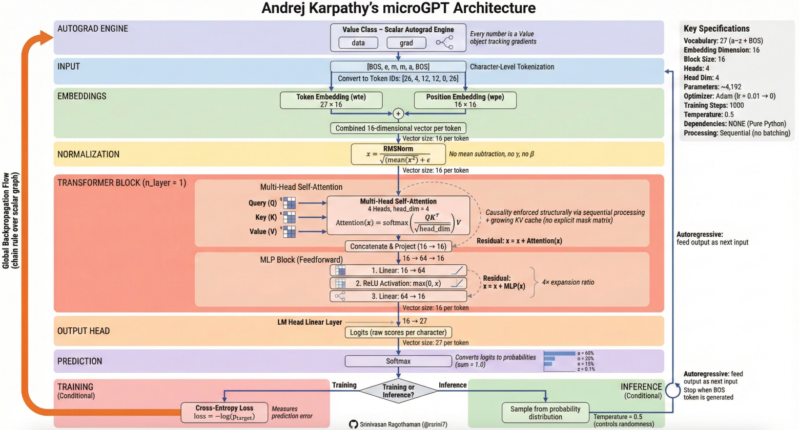

# Step 1: Understanding the Blueprint (microGPT)

## Overview

This assignment pulls apart the black box of large language models by
building a mini GPT-style model from scratch, anchored on Shakespeare. The
first step is to reverse-engineer a minimal, real-world GPT-style codebase
(microGPT) so the team understands how each matrix operation fits together
before architecting, training, and benchmarking our own mini-LLM
configurations in PyTorch.

`microgpt.py` is Andrej Karpathy's ~200-line, dependency-free Python
implementation of a GPT-style transformer. It trains and runs inference on
a character-level dataset (by default, a list of names) with no external
libraries — not even NumPy. This section reverse-engineers the codebase
using two sources: the gist itself, and the architecture visualization
diagram that maps each code block to its functional role in the
transformer pipeline.

**Sources used**

- Karpathy's `microgpt.py` gist — the authoritative source code.
- The architecture visualization diagram (infographic) — used as a visual
  index into the code, cross-checked against the gist for accuracy.

## Step 1.a — Andrej Karpathy's microGPT Gist

The gist (`microgpt.py`) is a ~200-line, dependency-free Python
implementation of a GPT-style transformer, trained and run on
character-level text with no external libraries — not even NumPy. Reading
it exposes every core component of a real transformer at its most atomic
level:

- A custom autograd engine (the `Value` class), which tracks `data`,
  `grad`, and parent nodes for each scalar, and applies the chain rule via
  `.backward()`.
- A character-level tokenizer with a special BOS token.
- Token and position embeddings (`wte`, `wpe`).
- RMSNorm normalization (no mean subtraction, no learnable gamma/beta).
- A multi-head self-attention block (`attn_wq`/`wk`/`wv`/`wo`) with
  causality enforced via a running keys/values cache rather than an
  explicit mask.
- An MLP feedforward block (`mlp_fc1` → ReLU → `mlp_fc2`) with residual
  connections.
- A manually implemented Adam optimizer and training loop using
  cross-entropy loss.
- Autoregressive inference via temperature-scaled sampling.

## Step 1.b — Architecture Visualization

Using the architecture visualization guide alongside the code turns the
abstract flowchart into something concrete — each diagram box maps
directly onto a specific variable or function in `microgpt.py` (e.g.,
"Autograd Engine" maps to the `Value` class; "Transformer Block" maps to
`attn_wq`/`wk`/`wv`/`wo` plus `mlp_fc1`/`fc2`). This mapping was confirmed
line-by-line, cross-checking every listed spec (vocab size 27, `n_embd=16`,
`block_size=16`, `n_head=4`, ~4,192 parameters, etc.) against the actual
source code.

*Figure 1. Andrej Karpathy's microGPT Architecture (diagram credit:
Srinivasan Ragothaman, @rsrini7).*

## Core Components (Code Walkthrough)

**1. Custom Autograd Engine (the `Value` class)**
Every scalar number is wrapped in a `Value` object storing `data`, `grad`,
its parent nodes (`_children`), and local gradients (`_local_grads`).
Operations such as `__add__`, `__mul__`, `.exp()`, `.log()`, and `.relu()`
each define how gradients flow backward. The `.backward()` method performs
a topological sort of the computation graph, then applies the chain rule
in reverse — a scalar-level mirror of the backpropagation concepts covered
in Victor Zhou's neural networks article.

**2. Tokenizer**
Character-level: every unique character in the dataset becomes a token ID,
plus one special BOS (beginning/end of sequence) token. Vocabulary size
equals the number of unique characters plus one.

**3. Parameters (`state_dict`)**
Includes token embeddings (`wte`), position embeddings (`wpe`), an LM
head, and per-layer weights: `attn_wq` / `attn_wk` / `attn_wv` / `attn_wo`
(attention projections) and `mlp_fc1` / `mlp_fc2` (feedforward). Weights
are initialized as small Gaussian-random `Value` matrices.

**4. Forward Pass (the `gpt()` function)**
Combine token + position embeddings, apply `rmsnorm`. Multi-head
attention: project into Q, K, V; split into `n_head` heads; compute scaled
dot-product attention per head using a running keys/values cache (this
enforces causality without an explicit mask); concatenate heads and
project back. Residual connection wraps the attention block. MLP block:
linear (16→64) → ReLU → linear (64→16), also wrapped in a residual
connection. Final linear layer (`lm_head`) maps back to vocab-size logits.

**5. Training Loop**
For each document, the sequence is tokenized with BOS on both ends, the
model runs step-by-step through it, and cross-entropy loss (-log of the
probability assigned to the correct next token) is computed.
`loss.backward()` propagates gradients, and all parameters are updated
with a manually implemented Adam optimizer (including bias-corrected
moving averages) over 1000 steps with linear learning-rate decay.

**6. Inference**
Autoregressive sampling: feed BOS, get logits, apply temperature-scaled
softmax, sample a token, feed it back in, and repeat until BOS is
generated again (end of sequence) or `block_size` is reached.

## Diagram-to-Code Mapping

The table below cross-references each section of the architecture diagram
against its exact implementation in `microgpt.py`.

| Diagram Section | Code Location in `microgpt.py` |
|---|---|
| Autograd Engine | The `Value` class — every scalar tracks `data`, `grad`, and parent nodes; `.backward()` applies the chain rule via topological sort. |
| Input / Tokenization | Character-level tokenizer: `uchars`, BOS token. Example: `[BOS, e, m, m, a, BOS]` → token IDs. |
| Embeddings | `state_dict['wte']` (token, 27×16) + `state_dict['wpe']` (position, 16×16), summed elementwise. |
| Normalization | `rmsnorm(x)` — no mean subtraction, no learnable gamma/beta, matches the diagram's formula exactly. |
| Transformer Block | `attn_wq` / `attn_wk` / `attn_wv` / `attn_wo` for 4-head attention (`head_dim=4`); scaled dot-product via a running keys/values cache (causality enforced without an explicit mask); residual add. Then `mlp_fc1` (16→64) → ReLU → `mlp_fc2` (64→16), also wrapped in a residual add. |
| Output Head | `state_dict['lm_head']`: linear layer mapping 16 → 27 logits (one score per vocabulary character). |
| Prediction | `softmax(logits)` converts raw scores into a probability distribution summing to 1.0. |
| Training vs. Inference | Training: cross-entropy loss `-log(p_target)` → `loss.backward()` → Adam update. Inference: temperature-scaled softmax sampling, autoregressive, stops when BOS is generated again or `block_size` is reached. |

## Confirmed Key Specifications

The following specifications from the diagram were cross-checked directly
against the source code and confirmed accurate.

| Spec | Value |
|---|---|
| Vocabulary size | 27 (26 lowercase letters + BOS) |
| Embedding dimension (`n_embd`) | 16 |
| Block size (context length) | 16 |
| Attention heads (`n_head`) | 4 |
| Head dimension | 4 |
| Total parameters | ~4,192 |
| Optimizer | Adam (lr = 0.01, linear decay to 0) |
| Training steps | 1000 |
| Sampling temperature | 0.5 |
| Dependencies | None — pure Python |
| Processing mode | Sequential (no batching) |

## Key Takeaway

`microgpt.py` demonstrates that a full GPT — autograd, embeddings,
multi-head attention, residual connections, an MLP block, an Adam
optimizer, and autoregressive sampling — can be built with plain Python
control flow and no matrix libraries. Everything the team does later with
PyTorch (tensors, batching, `nn.Module`, built-in autograd) is an
efficiency layer over these exact same underlying operations. This is the
conceptual bridge the assignment is built on: Victor Zhou's article
explains the micro-level math (neurons, gradients), the Transformer
Explainer visualizes the macro-level architecture (attention, softmax),
and `microgpt.py` shows precisely how the two connect in a working,
readable codebase.

*Note: the gist's public comment section contains unrelated community
forks, tooling links, and off-topic or unrelated pasted content; none of
this is part of Karpathy's original code and was excluded from this
analysis.*
