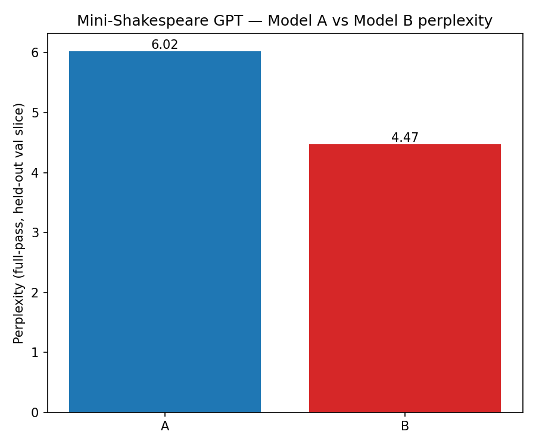

# Mini-Shakespeare LLM — Final Report

---

## a. Team Roles and Contributions

| Name | Role |
|---|---|
| Ali Sura Ozdemir | Task 1 — Architecture and Diagram |
| Ihina Mahajan | Task 2 — Dataset and Tokenization |
| Delaram Hassanlou | Task 3 — Transformer Model |
| Shivani Kandimalla | Task 4 — Training and Experiments |
| Mariem Guitouni | Task 5 — Evaluation, GitHub, and Report |

**Ali Sura Ozdemir — Task 1: Architecture and Diagram**

- Reviewed the microGPT code and architecture.
- Identified the embedding, attention, MLP, output head, training, and generation sections.
- Prepared the architecture blueprint writeup with a full code walkthrough of `microgpt.py`.

**Ihina Mahajan — Task 2: Dataset and Tokenization**

- Downloaded and loaded the Tiny Shakespeare dataset.
- Created the training and validation split.
- Implemented the byte-level tokenizer with vocabulary size 256.
- Created encoding, decoding, and batch-generation functions.

**Delaram Hassanlou — Task 3: Transformer Model**

- Built the GPT-style model in PyTorch.
- Implemented embeddings, self-attention, multi-head attention, feed-forward layers, transformer blocks, and the final language-model head.
- Implemented the text-generation function and verified all tensor shapes.

**Shivani Kandimalla — Task 4: Training and Experiments**

- Created two model configurations: Model A as the smaller baseline and Model B as the larger model.
- Wrote the training loop and trained both models for the same number of steps.
- Recorded training and validation losses.
- Saved the results and created the loss comparison graph.

**Mariem Guitouni — Task 5: Evaluation, GitHub, and Report**

- Calculated the final validation loss and perplexity for both models.
- Tested both models using 4 Shakespearean prompts and generated exactly 150 tokens.
- Got outputs from Gemini Flash using the same prompts and prepared the comparison table.
- Organized the GitHub repository, requirements file, README, graphs, outputs, and final report.
- Hand-annotated the architecture diagram with exact line-number mappings into the raw `microgpt.py` gist.

---

## b. Architecture Diagram

*Figure 1. Andrej Karpathy's microGPT architecture (base diagram credit:
Srinivasan Ragothaman, @rsrini7), hand-annotated by Mariem Guitouni with
the exact line numbers in the raw `microgpt.py` gist for each block
(editable source: `diagram/architecture_diagram.svg`).*

The table below transcribes the hand-written line-number annotations from
the figure above into a readable reference, cross-referencing each section
of the diagram against its exact implementation in the original
`microgpt.py` gist (full walkthrough in `diagram/blueprint_notes.md`):

| Diagram Section | Code Location in `microgpt.py` |
|---|---|
| Autograd Engine | The `Value` class — every scalar tracks `data`, `grad`, and parent nodes; `.backward()` applies the chain rule via topological sort. |
| Input / Tokenization | Character-level tokenizer: `uchars`, BOS token. Example: `[BOS, e, m, m, a, BOS]` → token IDs. |
| Embeddings | `state_dict['wte']` (token, 27×16) + `state_dict['wpe']` (position, 16×16), summed elementwise. |
| Normalization | `rmsnorm(x)` — no mean subtraction, no learnable gamma/beta. |
| Transformer Block | `attn_wq`/`wk`/`wv`/`wo` for 4-head attention (`head_dim=4`); scaled dot-product via a running keys/values cache (causality enforced without an explicit mask); residual add. Then `mlp_fc1` (16→64) → ReLU → `mlp_fc2` (64→16), also wrapped in a residual add. |
| Output Head | `state_dict['lm_head']`: linear layer mapping 16 → 27 logits. |
| Prediction | `softmax(logits)` converts raw scores into a probability distribution summing to 1.0. |
| Training vs. Inference | Training: cross-entropy loss `-log(p_target)` → `loss.backward()` → Adam update. Inference: temperature-scaled softmax sampling, autoregressive, stops when BOS is generated again or `block_size` is reached. |

The same block sequence carries over directly into our own PyTorch
implementation — embeddings, self-attention, multi-head attention,
feed-forward layers, transformer block, language-model head, training
loop, and generation — mapped to the exact corresponding lines in
`my-transformer/model.py` and `my-transformer/train.py`:

- **Token + positional embeddings** — `GPTLanguageModel.__init__`
  (`self.token_embedding`, `self.position_embedding`, lines 233–237) and
  applied in `forward` (lines 296–299): a byte id is looked up in a
  `(256, n_embd)` table and summed with a learned position vector.
- **Self-attention (single causal head)** — class `Head` (lines 71–123):
  three `Linear` projections to query/key/value, scaled dot-product scores,
  a lower-triangular causal mask (`self.tril`, registered as a buffer),
  softmax, weighted sum of values.
- **Multi-head attention** — class `MultiHeadAttention` (lines 129–152):
  `n_head` independent `Head`s run in parallel, concatenated back to width
  `C`, and mixed with an output projection.
- **Feed-forward / MLP** — class `FeedForward` (lines 158–179): per-token
  2-layer MLP, `C → 4C → C`, GELU activation.
- **Transformer block** — class `Block` (lines 185–209): pre-norm residual
  wiring — `x = x + attn(ln1(x))`, then `x = x + ffwd(ln2(x))`.
- **Output / LM head** — `self.lm_head` (line 247), weight-tied to the token
  embedding table (lines 252–253) — projects the final `(B, T, C)` hidden
  state to `(B, T, 256)` logits over the byte vocabulary.
- **Train loop** — `train_model()` in `my-transformer/train.py`
  (lines 106–154): AdamW, cross-entropy loss via `model(x, y)`, periodic
  train/val loss estimation (`estimate_loss`, lines 84–103), checkpoint +
  CSV logging.
- **Inference / generation** — `GPTLanguageModel.generate()` (lines
  318–354): autoregressive sampling, cropping context to the last
  `block_size` tokens, temperature scaling, optional top-k, one new byte
  sampled per step.

This mirrors the microGPT blueprint's own sequence — embeddings → attention
→ MLP → LM head → train loop → generation — with the scalar `Value`
autograd engine and manual Adam replaced by vectorized PyTorch tensor
operations.

---

## c. Hyperparameter Logs

The table below summarizes the configuration for Model A and Model B (also
saved in `evaluation/outputs/metrics.json`):

| Hyperparameter | Model A (baseline) | Model B (scaled) |
|---|---|---|
| Layers (`n_layer`) | 2 | 4 |
| Attention heads (`n_head`) | 4 | 8 |
| Embedding dim (`n_embd`) | 128 | 256 |
| Context length (`block_size`) | 64 | 128 |
| Vocabulary size | 256 | 256 |
| Dropout | 0.1 | 0.1 |
| Batch size | 64 | 64 |
| Learning rate | 3e-4 | 3e-4 |
| Training steps | 3,000 | 3,000 |
| Total parameters | 436,992 | 3,254,784 |

We varied depth, width, and context length between Model A and Model B,
while keeping batch size, learning rate, number of training steps, dropout,
and the optimizer (AdamW) identical across both. This isolates model scale
as the main difference between the two configurations.

---

## d. Empirical Graphs

**Training/validation loss curves** (Model A vs Model B, logged every 100
steps over 3,000 steps):

**Perplexity comparison** (final, full-pass over the held-out validation
slice):

Both curves show smooth, stable convergence for both models with no
divergence or instability — validation loss tracks training loss closely
throughout (no visible overfitting at 3,000 steps on either model), and
Model B's curve sits consistently below Model A's from roughly step 200
onward.

---

## e. Scale Narrative — Local Model vs. Industrial Architectures

To put this project's numbers in perspective, here is how Model A and Model
B compare to well-known industrial-scale language models:

| | Model A | Model B | GPT-2 (small/XL) | GPT-3 | Modern frontier (e.g. GPT-4/Claude class) |
|---|---|---|---|---|---|
| Parameters | 437K | 3.25M | 124M / 1.5B | 175B | reportedly 10\^11–10\^12+ |
| Context length | 64 bytes | 128 bytes | 1,024 tokens | 2,048 tokens | 100K–1M+ tokens |
| Vocabulary | 256 (raw bytes) | 256 (raw bytes) | ~50,257 (BPE) | ~50,257 (BPE) | ~100K–200K (BPE/tiktoken-style) |
| Training data | ~1.1MB (Tiny Shakespeare, 1 work) | same | ~40GB (WebText) | ~570GB curated (~300B tokens) | trillions of tokens, broad web/books/code |

**Parameters:** Model B's 3.25M parameters are roughly **54,000x smaller**
than GPT-3's 175B, and about 38x smaller than even GPT-2-small (124M).
Parameter count is the model's raw capacity to store statistical patterns;
at our scale, the network has just enough capacity to learn rough
letter-to-letter and letter-to-word transition statistics for one author's
style, not the deep compositional structure of language itself.

**Context length:** our 64–128 *byte* window covers roughly one short line
of dialogue. Modern frontier models track 100K+ *token* windows, where each
token is typically a whole word or word-piece — so the effective span of
"things the model can refer back to" differs not just by ~1,000x in raw
count but by an even larger factor once you account for bytes vs. subword
tokens. This directly explains why our models lose the thread within a
single sentence (see Section g) while large models maintain coherence across
many pages.

**Vocabulary / tokenization:** because we tokenize at the raw UTF-8 byte
level rather than using a learned subword vocabulary, every single
character — even the middle of a common word like "the" — costs the model 3
separate prediction steps. A BPE tokenizer used by GPT-2/3/4-class models
instead hands the model whole words or common sub-words as single tokens for
free, so those models spend their attention capacity on *meaning* and
*structure* rather than on *spelling*. This is very likely the single
largest architectural factor (independent of raw parameter count) behind
our models' frequent misspellings and malformed words (e.g. Model A's
"arreater'd", "fourfesss" — see Section g).

**Training data:** Tiny Shakespeare is about 1.1MB — a single author's
collected works. GPT-3-class models train on hundreds of gigabytes to
low-terabytes of diverse text (books, web pages, code, dialogue across every
register and topic); modern frontier models go further still, into
trillions of tokens. This gap — roughly five to six orders of magnitude —
is what separates **stylistic mimicry** (which our models achieve
reasonably well — see Model B's use of character names, stage-direction-like
formatting, and archaic diction in Section g) from **world knowledge and
general reasoning** (which requires having seen the relevant facts/patterns
somewhere in training, and which our models cannot have, since they have
only ever seen Shakespeare).

**What the gap explains:** coherence over long spans requires both large
context windows and enough parameters to track long-range dependencies —
our models have neither. World knowledge requires broad, large-scale
training data — ours has none beyond Shakespearean vocabulary and structure.
Generalization to novel prompts requires enough scale (parameters + data +
context) to learn abstractions rather than memorize surface statistics —
our models sit far below the scale where that transition tends to occur.
This is the expected consequence of training a decoder-only Transformer at
roughly 1/50,000th the parameter count and 1/500,000th the data of a
frontier system, not a flaw in the implementation.

---

## f. Quantitative Results

We computed the final validation loss and perplexity for each model as a
full pass over the entire held-out validation slice (111,540 bytes, the last
10% of `data/input.txt`), with dropout disabled. This is a more thorough
measurement than the random-batch estimate logged periodically during
training, shown below for reference:

| | Model A | Model B |
|---|---|---|
| Final validation loss (full pass) | 1.7952 | 1.4983 |
| Perplexity = e^loss (full pass) | 6.02 | 4.47 |
| (for reference) training-time estimate, val loss | 1.7996 | 1.5025 |
| (for reference) training-time estimate, perplexity | 6.05 | 4.49 |

The full-pass numbers are very close to the training-time random-batch
estimates for both models (within ~0.004 loss), which is a useful sanity
check: it confirms the 50-batch random estimate used during training was
not systematically biased, and that neither model is meaningfully
overfitting the specific batches it happened to be evaluated on during
training.

Model B achieves both lower loss and lower perplexity than Model A. A
perplexity of 6.02 means Model A's next-byte predictions are, on average, as
uncertain as choosing uniformly among about 6 candidate bytes; Model B
narrows that to about 4.5. Given the byte-level vocabulary size of 256, both
numbers represent substantial, non-trivial learning (uniform-random
next-byte guessing would give a perplexity of 256), and the ~25% relative
perplexity reduction from A to B is consistent with — and proportional to —
Model B's roughly 7.5x parameter increase and 2x context-length increase.

---

## g. Qualitative Results

We generated 150 tokens of completion for four fixed Shakespearean prompts
using Model A and Model B (default sampling settings: temperature 1.0, no
top-k), and compared them against Gemini Flash, queried manually through the
Gemini web UI with the same four prompts. Full text:
`evaluation/outputs/generations.json`; merged 3-model table with
auto-detected repetition flags: `evaluation/outputs/comparison_table.md`.

Representative example — prompt `"To be, or not to "`:

- **Model A:** `"plise all that broke, / 'And tpoon we of ot seed thing not do him it our arreater'd the worn; / As a this not his thy want for a name outher, / Or fourfesss"`
- **Model B:** `"deal, / Come, my lord. / LUCIO: / POMPEY: / I gain; strange the king! / LUCIO: / I prithee, / My poor name no fight in him. / Messenger: / Have I have ansacred her"`
- **Gemini Flash:** `"be, that is the question: Whether 'tis nobler in the mind to suffer The slings and arrows of outrageous fortune, Or to take arms against a sea of troubles, And by opposing end them?"` — the real Hamlet text, verbatim.

**Observed failure modes (local models):**

- **Model A (437K params, 64-byte context)** produces frequent malformed,
  non-dictionary "words" (`"arreater'd"`, `"fourfesss"`, `"tpoon"`) — direct
  evidence of the byte-level tokenizer forcing the model to spell words out
  letter-by-letter without enough capacity to reliably do so. Line breaks
  and loose iambic rhythm are present (learned surface structure), but
  sentences do not resolve into coherent meaning.
- **Model B (3.25M params, 128-byte context)** is visibly more structurally
  stable: it correctly produces well-formed play-script conventions —
  ALL-CAPS speaker labels followed by a colon (`LUCIO:`, `POMPEY:`,
  `Messenger:`), consistent line breaks, and mostly well-formed English
  words — even while the *content* of each line is still largely
  semantically incoherent or non-sequitur. This is a direct, visible
  consequence of the added depth/width/context from Section c.
- **Degenerate repetition loops:** the automatic n-gram detector
  (`comparison_table.py::detect_repetition`, flags any 3–6 word sequence
  repeated ≥3 times) found no strong repetition loops in any of the three
  models at 150 tokens for these four prompts. This is somewhat smaller-scale
  evidence than one might expect from a ~437K-parameter model; longer
  generations or a lower temperature would be more likely to surface the
  classic small-LM repetition-loop failure mode.
- **Structural stability** and **Shakespearean styling accuracy** are
  reported in `comparison_table.md` as manual-judgment columns rather than
  automated scores, since these are subjective calls best made by a human
  reader. Across all four prompts, the pattern is consistent: Model A rates
  low on both — its output breaks down into malformed non-words too quickly
  to read as stable or convincingly Shakespearean. Model B rates moderate
  on structure (correct speaker-label formatting, mostly grammatical short
  lines, but still several broken clauses and invented words) and
  moderate-to-good on styling (real character names, archaic contractions
  like "'twixt" and "'tis", a consistent play-script register). Gemini is
  either verbatim-perfect (when it completes the text directly) or
  structurally sound but stylistically unShakespearean (when it switches
  into explanatory prose instead of continuing the passage).

**Gemini Flash: a different kind of failure mode entirely.** Gemini did not
fail the way the local models did — every completion was fluent, correctly
spelled, grammatically perfect English. But it also did not behave like a
completion model. Its four responses split cleanly into two behaviors:

- **Prompts 1 ("To be, or not to ") and 3 ("Friends, Romans, countrymen,
  lend me your "):** Gemini gave a direct, uncommented continuation — and
  in both cases, the *actual, correct, verbatim* Shakespeare text (the rest
  of Hamlet's soliloquy; "ears! I come to bury Caesar, not to praise him."
  from Julius Caesar). This is expected: Gemini Flash has almost certainly
  memorized these exact passages from its training data, so "completion
  accuracy" here reflects retrieval of memorized text, not generalization.
- **Prompts 2 ("O Romeo, Romeo, wherefore art thou ") and 4 ("Now is the
  winter of our discontent"):** Gemini did *not* continue the text at all.
  Instead it broke into an explanatory, chat-assistant register — "This is
  a well-known line spoken by Juliet...", complete with a correction of the
  common "wherefore = where" misconception, a *Meaning* section glossing
  "winter of our discontent" and "sun of York", and only embedded the
  actual Shakespeare continuation as a quoted aside inside the explanation
  rather than as a direct completion.

This inconsistency highlights a genuine categorical difference between our
local models and a production system. Our Model A/B are raw next-byte
predictors with no instruction-tuning — they always continue the text,
because "continue the text" is the only behavior they were ever trained to
produce. Gemini Flash is instruction-tuned on top of a base model, so
identical raw text handed to it is ambiguous between "continue this" and
"tell me about this," and the two most iconic prompts (Romeo's balcony line,
Richard III's opening) apparently triggered its "this looks like a question
about a famous quote" instinct, while the two less over-quoted-as-trivia
prompts did not. A fairer apples-to-apples benchmark would force raw
completion (e.g. via Google AI Studio's freeform/text-completion mode rather
than the chat UI, or an explicit "continue this text, output nothing else"
instruction) — but the raw web-UI behavior observed here is arguably more
representative of how a free-tier production LLM actually behaves for an
average user.

---

## h. Conclusion

This project builds a working decoder-only Transformer, entirely from
PyTorch primitives (no `nn.Transformer`/`nn.MultiheadAttention`), trained on
a byte-level tokenization of Tiny Shakespeare, and compares two scale
configurations under otherwise identical training conditions. Both models
converge stably over 3,000 steps with no divergence; Model B's larger
depth, width, and context window produce consistently lower validation loss
(1.4983 vs. 1.7952) and perplexity (4.47 vs. 6.02), and visibly more
structurally stable generations (correct speaker-label formatting, fewer
malformed words), even though neither model produces semantically coherent
Shakespearean text. The gap between these models and industrial-scale
systems — on the order of 10\^4–10\^5 in parameters and training data, and
10\^3 in context length — accounts directly for the specific failure modes
observed: our models can imitate surface style (line structure, archaic
diction, dialogue formatting) but cannot maintain sentence-level coherence
or draw on any world knowledge, because they have neither the capacity nor
the training exposure to have learned either. Gemini Flash's behavior
sharpens this contrast further: for two of the four prompts it reproduced
the exact, correct Shakespeare text verbatim (near-certain evidence of
memorization from web-scale training data our models could never have
seen), and for the other two it didn't complete the text at all — its
instruction-tuning made it treat a bare line of verse as a question to
answer rather than a passage to continue, a behavior category that doesn't
even exist for our untuned local models. Overall, this project shows a
complete, working transformer language model — embeddings, causal
self-attention, multi-head attention, feed-forward layers, and
autoregressive sampling, all built from scratch in PyTorch — trained and
evaluated at two different scales, and makes clear just how much of a
modern assistant's coherence and world knowledge comes from scale rather
than architecture alone.
